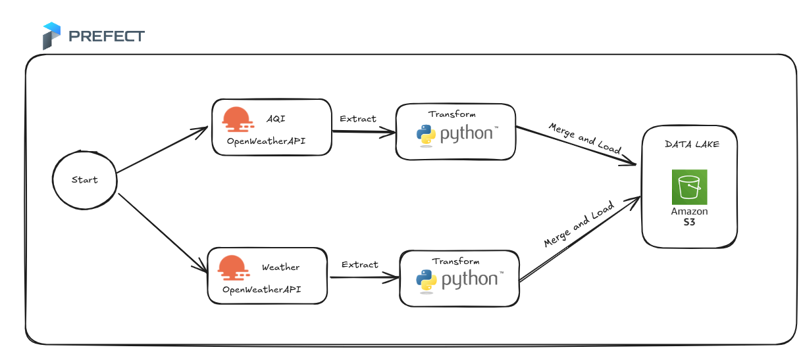

# Air Quality Ingestion Pipeline

This project implements a data ingestion pipeline that retrieves weather and air quality data for various cities in Cameroon using the OpenWeatherMap API. The collected data is transformed and saved to an Amazon S3 bucket using Prefect for workflow orchestration.



## Project Structure

AIR-QUALITY-INGESTION-PIPELINE <br>
│
├── data/ <br>
├── pipelines/ <br>
│   └── data_ingestion.py <br>
├── README.md <br>
├── requirements.txt <br>
└── Dockerfile


- `data/`: Directory where the combined data will be stored.
- `pipelines/`: Contains the main Python script for data ingestion (`data_ingestion.py`).
- `README.md`: Documentation for the project.
- `requirements.txt`: Lists the Python dependencies required for the project.
- `Dockerfile`: Configuration file for building the Docker image.

## Prerequisites

- [Docker](https://www.docker.com/products/docker-desktop) installed on your machine.
- An account with [OpenWeatherMap](https://openweathermap.org/) to obtain an API key.
- An [AWS](https://aws.amazon.com/) account to create an S3 bucket and obtain access keys.

## Setup

1. **Create an S3 Bucket:**
   Ensure you have an S3 bucket named `zeguild-bucket` in your AWS account. This is where the combined data will be stored.

2. **Clone the Repository:**
   ```bash
   git clone https://github.com/NembotJules/Air-Quality-Ingestion-Pipeline.git
   cd AIR-QUALITY-INGESTION-PIPELINE

3. **Set Up Environment Variables:** You'll need to set the following environment variables:
   ```bash
   export WEATHER_API_KEY=<your_weather_api_key>
   export AWS_ACCESS_KEY_ID=<your_aws_access_key_id>
   export AWS_SECRET_ACCESS_KEY=<your_aws_secret_access_key>


4. **Build the Docker Image:**

```bash
docker build -t air-quality-ingestion-pipeline .
```

5. **Run Docker Container**

```bash
docker run -e WEATHER_API_KEY=<your_weather_api_key> \
           -e AWS_ACCESS_KEY_ID=<your_aws_access_key_id> \
           -e AWS_SECRET_ACCESS_KEY=<your_aws_secret_access_key> \
           -p 8080:8080 -p 4200:4200 \
           air-quality-ingestion-pipeline

```

6. **Access the Prefect UI:**

- Prefect Server: http://localhost:8080
- Prefect UI: http://localhost:4200


## How it works

The pipeline performs the following steps:

- Extract Weather Data: Retrieves weather data for specified cities using the OpenWeatherMap API.<br>

- Extract Air Quality Data: Retrieves air quality data for the same cities using the OpenWeatherMap API.<br>

- Transform Data: Combines the weather and air quality data into a single DataFrame, adds an air quality category based on the AQI (Air Quality Index), and saves it as a CSV file.<br>

- Save to S3: Uploads the combined data to the S3 bucket named zeguild-bucket.


## Additional Notes

- Ensure that your AWS credentials have the necessary permissions to write to the S3 bucket. <br>
- The combined data will be saved in the data/ directory within the Docker container.